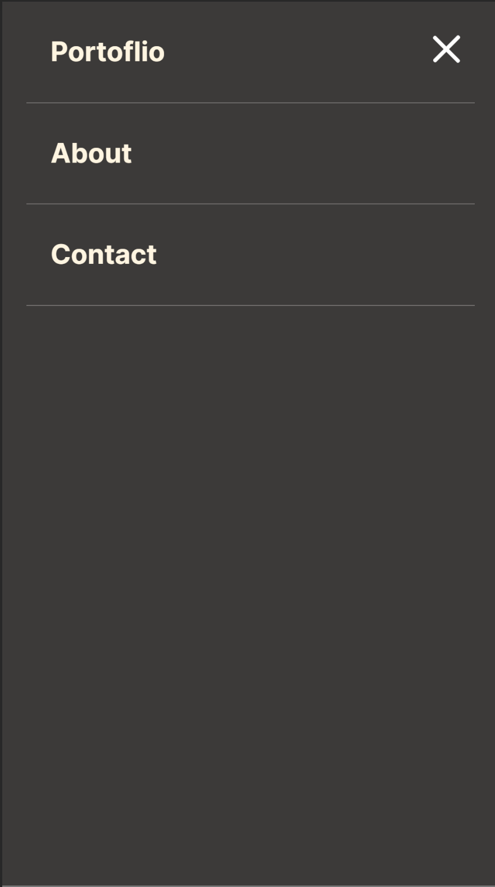

# Mobile Menu

## Table of Contents

* [About the Project](#about-the-project)
* [Built With](#built-with)
* [Getting Started](#getting-started)
* [Contributing](#contributing)
* [Author](#author)
* [Acknowledgements](#acknowledgements)

## About Project

This project builds on an existing codebase on a portfolio project. The main aim is develop the mobile menu.

Application is based on this [Figma design](https://www.figma.com/file/t3EJUCAEViw3QasuJLPLVT/Microverse-Student-Potfolio-Templates-Main?node-id=1%3A1471).



## [Live Demo](https://lameck1.github.io/mobile-menu/)

## Built With

* HTML5
* CSS
* Javascript

## Getting Started

* Clone this repo <https://github.com/Lameck1/mobile-menu>

    ```bash
    git clone https://github.com/Lameck1/mobile-menu.git
    ```

* Navigate to mobile-menu folder/directory

    ```bash
    cd mobile-menu
    ```

* Next, manually open the ```index.html``` file to interact with project.

## Contributing

Contributions, issues, and feature requests are welcome!

Feel free to check the [issues page](https://github.com/Lameck1/mobile-menu/issues)

  1. Fork the Project
  2. Create your Feature Branch (`git checkout -b feature/newFeature`)
  3. Commit your Changes (`git commit -m 'Add some newFeature'`)
  4. Push to the Branch (`git push -u origin feature/newFeature`)
  5. Open a Pull Request

## Author

👤 **Lameck Otieno**

* GitHub: [@githubhandle](https://github.com/Lameck1)
* Twitter: [@twitterhandle](https://twitter.com/lameck721)
* LinkedIn: [LinkedIn](https://www.linkedin.com/in/lameck-odhiambo-642b7077/)
* Portfolio: [Portfolio](https://lameck.me)

## Acknowledgements

Credits go to the following for providing guides on JavaScript

* [**MDN Web Docs**](https://developer.mozilla.org/en-US/docs/Learn/JavaScript/Objects)
* [Freecodecamp](https://www.freecodecamp.org/learn/javascript-algorithms-and-data-structures/)

## Show your support

Give a ⭐️ if you like this project!
